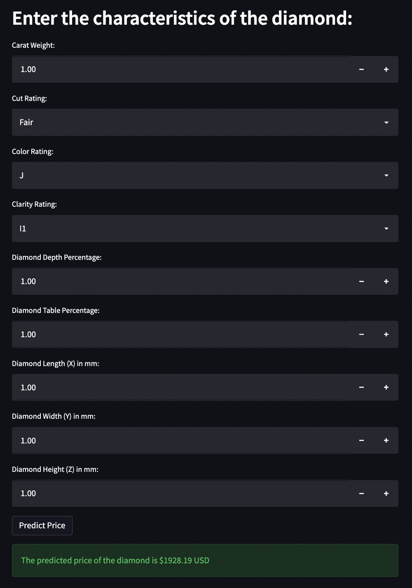

# Diamond Price Predictor App using Streamlit #
Original [article](https://medium.com/towards-data-science/deploying-ml-models-using-streamlit-5d6212453bdd) by Nate DiRenzo, forked by Robin to tidy up some missing requirements and refine documentation

### Statement of Purpose
The purpose of this repository is as a tutorial for creating a regression model that predicts the price of a diamond, and building a simple frontend application to make the model publicly available using Streamlit.

### Data Description
The data we will be using for this project is the [Diamonds](https://www.kaggle.com/datasets/shivam2503/diamonds) dataset, which is publicly available via Kaggle. It contains 53940 observations, and 10 features in the dataset.

### Tools
- **Pandas** for accessing the data, and preparing the it for modeling.
- **XGBoost** for creating a gradient-boosted regression model.
- **Streamlit** for creating a frontend application

### Notes
- Each diamond has a Cut, Color, and Clarity rating on a scale. For Cut, the scale(from highest to lowest) is `Ideal>Premium>Very Good>Good>Fair`. Because of this hierarchy, we can call these `ordinal categorical variables` 
- Throw a `GridSearchCV` at an XGBoost Regressor to come up with an optimal fit quickly, 8mins on M1 Mac

## Setup
* `python3 -m venv venv`
* `source venv/bin/activate`
* `pip install -r requirements.txt`
* `pip install streamlit`
* `streamlit run app.py`

